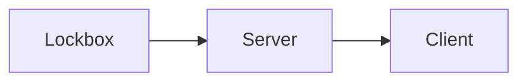

# Mercury Layer

Mercury Layer is a Layer 2 protocol for Bitcoin that enables the self-custodial transfer of coins (UTXOs) without on-chain transactions.

This repository contains the server, Rust client, and lockbox implementations. Lockbox stores key material, performs partial signatures, and exposes the signer HTTP API consumed by the Mercury server. The client is run by the user as a standalone Rust application that makes HTTP requests to the server API.

# License

Mercury Layer is released under the terms of the GNU General Public License. See for more information https://opensource.org/licenses/GPL-3.0
