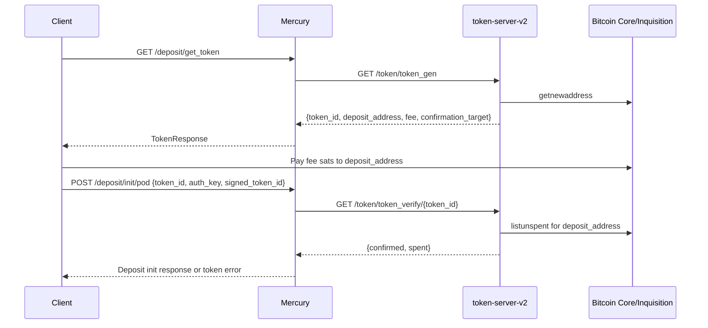

# Token payment system

Deposit tokens authorize creation of a statechain deposit. In production, tokens are paid onchain through `token-server-v2`. The token server does not sign transactions and does not hold private keys; it uses a Bitcoin Core/Inquisition watch-only descriptor wallet to generate receive addresses and verify payment UTXOs.

## Components

- Mercury server exposes `/deposit/get_token` and `/deposit/init/pod`.
- `token-server-v2` exposes `/token/token_gen` and `/token/token_verify/<token_id>`.
- Bitcoin Core/Inquisition provides token payment addresses and UTXO confirmation status through wallet RPC.
- The token database stores `token_id`, `onchain_address`, `confirmed`, and `spent`.

## Token generation

Clients request tokens through Mercury:

```text
GET /deposit/get_token
```

If `TOKEN_SERVER_URL` is configured, Mercury calls `token-server-v2`:

```text
GET /token/token_gen
```

`token-server-v2` then:

1. Gets a new address from the configured Core/Inquisition token wallet.
2. Generates a UUID `token_id`.
3. Inserts a token row with `confirmed = false` and `spent = false`.
4. Returns the token payment details.

Mercury returns the token response to the client in this shape:

```json
{
  "token_id": "...",
  "payment_method": "onchain",
  "deposit_address": "...",
  "fee": 10000,
  "confirmation_target": 2
}
```

For local non-mainnet development, if `TOKEN_SERVER_URL` is not configured, Mercury can issue a free token directly from its own database. Free token generation is not supported on mainnet.

## Token payment and verification

The client pays exactly `fee` sats to `deposit_address` and waits for the configured `confirmation_target` confirmations.

During verification, `token-server-v2`:

1. Loads the token row by `token_id`.
2. Returns the stored status immediately if the token is already confirmed or spent.
3. Validates the stored onchain address against the configured Bitcoin network.
4. Calls Core/Inquisition wallet RPC `listunspent` for that address.
5. Looks for a UTXO with `amount_sats == fee`.
6. Checks that the UTXO has at least `confirmation_target` confirmations.
7. Marks the token confirmed once payment is found with enough confirmations.

The verification response is:

```json
{
  "confirmed": true,
  "spent": false
}
```

or:

```json
{
  "confirmed": false,
  "spent": false
}
```

## Deposit process

When a client initializes a deposit, it signs the `token_id` with its auth key and sends the signed token to Mercury:

```text
POST /deposit/init/pod
```

Mercury verifies the auth signature over the `token_id`. If `TOKEN_SERVER_URL` is configured, Mercury then calls `token-server-v2`:

```text
GET /token/token_verify/<token_id>
```

The deposit proceeds only if the token is confirmed and unspent. After a successful deposit, Mercury marks the token spent in its database.

## Sequence



## Removed legacy flow

The current token flow does not use a payment processor, `processor_id`, Lightning invoice, or `token_init` endpoint. Token payment verification is based on Core/Inquisition wallet UTXOs for the generated onchain address.
